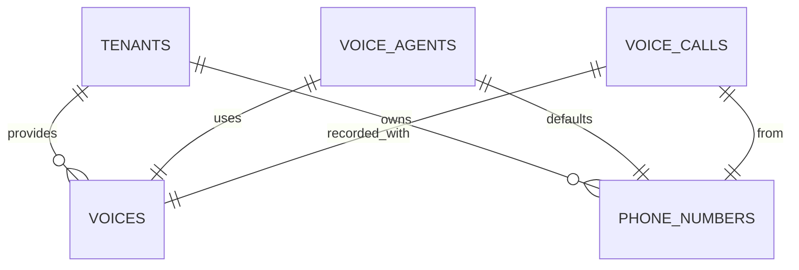

# Database Model Gap Analysis

## ERD Analysis vs Created Models

### ✅ What We Have

1. **VoiceCallModel** (`voice_calls`)
   - tenant_id ✅
   - agent_id ✅
   - lead_id ✅
   - voice_id ✅
   - Basic call tracking ✅

2. **VoiceAgentModel** (`voice_agents`)
   - tenant_id ✅
   - Basic agent config ✅

3. **VoiceModel** (`voices`) - **Not in ERD**
   - Supports voice profile management
   - tenant_id ✅

4. **PhoneNumberModel** (`phone_numbers`) - **Not in ERD**
   - Phone number inventory
   - tenant_id ✅

5. **PhoneResolverModel** - Utility model
   - Cross-table resolution

---

## ❌ Critical Gaps (From ERD)

### 1. **Tenant & User Management** (HIGH PRIORITY)

**Missing:** `TENANTS`, `USERS`, `MEMBERSHIPS` tables and models

```
ERD Shows:
TENANTS ||--o{ MEMBERSHIPS : has
USERS ||--o{ MEMBERSHIPS : belongs_to
```

**Current Issue:**
- We have `tenant_id` everywhere but no Tenant model
- No User model
- No user-tenant membership management
- Can't handle multi-user organizations

**Need to Add:**

```javascript
// TenantModel.js
class TenantModel {
  async getTenantById(tenantId)
  async createTenant({name, plan, ...})
  async updateTenant(tenantId, updates)
  async getTenantUsers(tenantId)
  async getTenantFeatures(tenantId)
}

// UserModel.js
class UserModel {
  async getUserById(userId)
  async getUserByEmail(email)
  async createUser({email, name, ...})
  async getUserTenants(userId) // via memberships
}

// MembershipModel.js
class MembershipModel {
  async addUserToTenant(userId, tenantId, role)
  async removeUserFromTenant(userId, tenantId)
  async getUserRole(userId, tenantId)
  async getTenantMembers(tenantId)
}
```

**Database Tables:**
```sql
CREATE TABLE tenants (
  id UUID PRIMARY KEY,
  name VARCHAR(255) NOT NULL,
  plan_id UUID REFERENCES plans(id),
  is_active BOOLEAN DEFAULT true,
  created_at TIMESTAMP DEFAULT NOW(),
  updated_at TIMESTAMP DEFAULT NOW()
);

CREATE TABLE users (
  id UUID PRIMARY KEY,
  email VARCHAR(255) UNIQUE NOT NULL,
  first_name VARCHAR(100),
  last_name VARCHAR(100),
  created_at TIMESTAMP DEFAULT NOW(),
  updated_at TIMESTAMP DEFAULT NOW()
);

CREATE TABLE memberships (
  id UUID PRIMARY KEY,
  user_id UUID REFERENCES users(id) ON DELETE CASCADE,
  tenant_id UUID REFERENCES tenants(id) ON DELETE CASCADE,
  role VARCHAR(50) DEFAULT 'member',
  created_at TIMESTAMP DEFAULT NOW(),
  UNIQUE(user_id, tenant_id)
);
```

---

### 2. **Plans & Features System** (MEDIUM PRIORITY)

**Missing:** Plans, Features, Feature Management

```
ERD Shows:
PLANS ||--o{ PLAN_FEATURES : includes
FEATURES ||--o{ PLAN_FEATURES : mapped
TENANTS ||--o{ TENANT_FEATURES : overrides
```

**Current Issue:**
- No plan management
- No feature flags
- Can't control what features tenants have access to
- Can't differentiate free/pro/enterprise

**Need to Add:**

```javascript
// PlanModel.js
class PlanModel {
  async getAllPlans()
  async getPlanById(planId)
  async getPlanFeatures(planId)
  async createPlan({name, price, ...})
}

// FeatureModel.js
class FeatureModel {
  async getAllFeatures()
  async getFeatureById(featureId)
  async isTenantFeatureEnabled(tenantId, featureKey)
}

// TenantFeatureModel.js
class TenantFeatureModel {
  async enableFeatureForTenant(tenantId, featureId)
  async disableFeatureForTenant(tenantId, featureId)
  async getTenantFeatures(tenantId)
  async checkFeatureAccess(tenantId, featureKey)
}
```

**Database Tables:**
```sql
CREATE TABLE plans (
  id UUID PRIMARY KEY,
  name VARCHAR(100) NOT NULL,
  price NUMERIC,
  billing_cycle VARCHAR(20),
  is_active BOOLEAN DEFAULT true,
  metadata JSONB DEFAULT '{}',
  created_at TIMESTAMP DEFAULT NOW()
);

CREATE TABLE features (
  id UUID PRIMARY KEY,
  feature_key VARCHAR(100) UNIQUE NOT NULL,
  name VARCHAR(255) NOT NULL,
  description TEXT,
  feature_type VARCHAR(50), -- 'boolean', 'limit', 'addon'
  default_value JSONB,
  created_at TIMESTAMP DEFAULT NOW()
);

CREATE TABLE plan_features (
  id UUID PRIMARY KEY,
  plan_id UUID REFERENCES plans(id) ON DELETE CASCADE,
  feature_id UUID REFERENCES features(id) ON DELETE CASCADE,
  feature_value JSONB, -- e.g., {"enabled": true, "limit": 1000}
  UNIQUE(plan_id, feature_id)
);

CREATE TABLE tenant_features (
  id UUID PRIMARY KEY,
  tenant_id UUID REFERENCES tenants(id) ON DELETE CASCADE,
  feature_id UUID REFERENCES features(id) ON DELETE CASCADE,
  feature_value JSONB, -- Override plan defaults
  enabled_at TIMESTAMP DEFAULT NOW(),
  expires_at TIMESTAMP,
  UNIQUE(tenant_id, feature_id)
);
```

---

### 3. **AI Sessions & ICP Profiles** (OUT OF SCOPE - But Note in ERD)

```
ERD Shows:
TENANTS ||--o{ AI_SESSIONS : runs
AI_SESSIONS ||--o{ AI_MESSAGES : contains
AI_SESSIONS ||--|| ICP_PROFILES : produces
AI_SESSIONS ||--o{ AI_USAGE : tracks
```

**Status:** Not in voice-agent feature scope, but should exist in main backend
- These likely belong in a separate feature module (ai-icp-builder)
- Voice agent doesn't need these models directly

---

### 4. **Apollo Integration** (OUT OF SCOPE - But Note in ERD)

```
ERD Shows:
ICP_PROFILES ||--o{ APOLLO_SEARCHES : drives
APOLLO_SEARCHES ||--o{ APOLLO_RESULTS : returns
LEADS ||--o{ APOLLO_RESULTS : matched
```

**Status:** Not in voice-agent scope
- Apollo search functionality is separate feature
- Voice agent consumes leads but doesn't manage Apollo searches

---

### 5. **Leads Management** (PARTIAL GAP)

```
ERD Shows:
TENANTS ||--o{ LEADS : owns
LEADS ||--o{ VOICE_CALLS : contacted
LEADS ||--o{ APOLLO_RESULTS : matched
```

**Current Issue:**
- We reference `leads` table but don't have a LeadModel in voice-agent
- Assuming leads exist in main backend
- Voice agent should have helper methods to work with leads

**Recommended:**

```javascript
// LeadModel.js (in voice-agent context)
class LeadModel {
  async getLeadById(leadId, tenantId)
  async getLeadByPhone(phone, tenantId)
  async createLead({tenantId, name, phone, source})
  async updateLead(leadId, tenantId, updates)
  async getLeadCallHistory(leadId, tenantId)
  async markLeadContacted(leadId, tenantId, callId)
}
```

---

## 🔍 Voice Agent Specific Gaps

### 6. **Voice Agents Configuration** (INCOMPLETE)

**ERD Shows:**
```
TENANTS ||--o{ VOICE_AGENTS : configures
VOICE_AGENTS ||--o{ VOICE_CALLS : executes
```

**Current Model Issues:**
- VoiceAgentModel is too basic
- Missing relationships to VOICES and PHONE_NUMBERS
- Missing user/creator relationship
- No default configurations

**Need to Enhance:**

```javascript
// VoiceAgentModel enhancements needed:
- Link to VOICES table (voice_id foreign key)
- Link to PHONE_NUMBERS table (default_number_id)
- Created by user tracking
- Agent instructions/prompts
- Knowledge base associations (if applicable)
```

**Enhanced Schema:**
```sql
ALTER TABLE voice_agents
ADD COLUMN voice_id UUID REFERENCES voices(id),
ADD COLUMN default_number_id UUID REFERENCES phone_numbers(id),
ADD COLUMN created_by UUID REFERENCES users(id),
ADD COLUMN agent_instructions TEXT,
ADD COLUMN system_instructions TEXT,
ADD COLUMN outbound_prompt TEXT,
ADD COLUMN inbound_prompt TEXT;
```

---

### 7. **Voice Calls Enhancements** (INCOMPLETE)

**Missing from VoiceCallModel:**
- AI usage tracking integration
- Cost tracking
- Transcription support
- VAPI integration fields
- Batch call support

**Need to Add:**

```javascript
// VoiceCallModel enhancements:
async getCallWithTranscription(callId, tenantId)
async getCallCost(callId, tenantId)
async getCallAIUsage(callId, tenantId)
async updateCallVAPIData(callId, tenantId, vapiData)
```

**Enhanced Schema:**
```sql
ALTER TABLE voice_calls
ADD COLUMN vapi_call_id VARCHAR(255) UNIQUE,
ADD COLUMN vapi_data JSONB,
ADD COLUMN transcription JSONB,
ADD COLUMN cost NUMERIC(10,2),
ADD COLUMN cost_breakdown JSONB,
ADD COLUMN call_duration INTEGER, -- seconds
ADD COLUMN batch_id UUID; -- for batch calls
```

---

### 8. **Missing ERD Entities** (ADD TO ERD)

These are in our models but **NOT in the ERD** - should be added:



**Reasoning:**
- VOICES table is essential for voice agent configuration
- PHONE_NUMBERS table is essential for call origination
- These relationships exist in code but missing from ERD

---

## 📋 Summary of Gaps

### Critical (Must Fix for Voice Agent to Work):

1. ❌ **TenantModel** - No tenant management
2. ❌ **UserModel** - No user management
3. ❌ **MembershipModel** - No user-tenant relationship
4. ⚠️ **VoiceAgentModel** - Incomplete (missing voice/number relationships)
5. ⚠️ **VoiceCallModel** - Missing fields (vapi_data, cost, transcription)

### Important (Should Have):

6. ❌ **PlanModel** - No subscription management
7. ❌ **FeatureModel** - No feature flags
8. ❌ **TenantFeatureModel** - No feature overrides
9. ⚠️ **LeadModel** - No lead management in voice-agent context

### Nice to Have:

10. 📝 Add VOICES and PHONE_NUMBERS to ERD
11. 📝 Link AI_USAGE to VOICE_CALLS (for cost tracking)

### Out of Scope (Handled by Other Features):

- AI_SESSIONS / AI_MESSAGES / ICP_PROFILES
- APOLLO_SEARCHES / APOLLO_RESULTS

---

## 🎯 Recommended Action Plan

### Phase 1: Core Infrastructure (Blocking)
1. Create TenantModel + tenants table
2. Create UserModel + users table  
3. Create MembershipModel + memberships table
4. Update all existing models to properly reference users/tenants

### Phase 2: Voice Agent Completion
5. Enhance VoiceAgentModel (add missing fields/relationships)
6. Enhance VoiceCallModel (add vapi_data, cost, transcription)
7. Create LeadModel (voice-agent context helpers)

### Phase 3: Business Logic
8. Create PlanModel + plans table
9. Create FeatureModel + features table
10. Create TenantFeatureModel + feature management

### Phase 4: Documentation
11. Update ERD with VOICES and PHONE_NUMBERS entities
12. Document complete data flow

---

## 🚨 Breaking the Model Structure

**Current Problem:**
Our models assume `tenant_id` exists everywhere, but we have no way to:
- Create tenants
- Manage tenant users
- Check user permissions
- Verify tenant subscriptions

**Without TenantModel/UserModel/MembershipModel:**
- Can't authenticate users
- Can't validate tenant access
- Can't enforce permissions
- Models are orphaned

**This is a critical gap that must be addressed before voice agent can function.**

